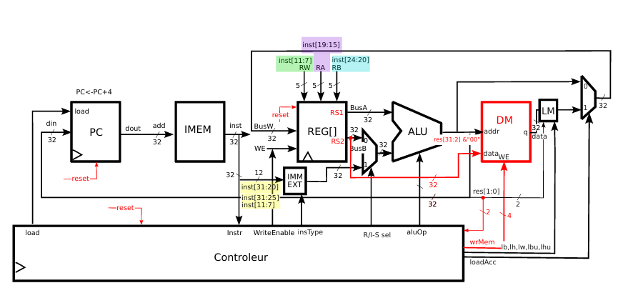

# RISC-V Processor Testbench

This project implements a simple RISC-V processor with **R+I+S** architecture and a testbench for simulation. It includes the main components: PC, register file, ALU, controller, instruction memory (IMEM), and data memory (DM).




## Project Components

- **PC**: Program counter, increments each clock cycle.  
- **REGFILE**: Register file, initialized with register indices as values.  
- **ALU**: Arithmetic and logic unit, supports R- and I-type operations.  
- **Controller**: Generates control signals (ALUOp, WriteEnable, Load, wrMem…).  
- **IMEM**: Instruction memory, loaded with the test program.  
- **DM**: Data memory, supports byte, half-word, and word writes.  
- **SM**: Store Manager, prepares data for DM writes.  
- **Imm_ext**: Extracts immediates for I-type and S-type instructions.

## Simulation

The testbench generates a **clock** and a **reset** signal, loads instructions from `program.txt`, and initializes the registers. Observable signals include:

- `pc_out`: current value of the PC  
- `instruction`: instruction being executed  
- `busA`, `busB`: values of source registers  
- `alu_result`: result from the ALU  
- `write_enable`: write signal to REGFILE  
- `load`: indicates a load instruction  
- `wrMem`: triggers write to DM  
- `storeData`: data to be stored in DM  

## Test Program

`program.txt` contains a small RISC-V program testing **ADDI, SLLI, ADD, SW, LW, SB** instructions.  

The corresponding assembly code is:

```asm
addi x1,x0,0x12
slli x1,x1,24
addi x2,x0,0x34
...
